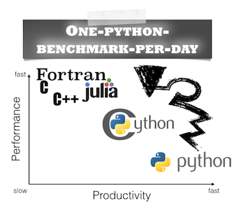

An ongoing project for benchmarking different Python approaches - ideally one per day!

 
 
I would be happy to hear your comments and suggestions.  
Please feel free to drop me a note via
[twitter](https://twitter.com/rasbt), [email](mailto:bluewoodtree@gmail.com), or [google+](https://plus.google.com/118404394130788869227).

 

- **Day 1** - Reversing strings [[html](http://htmlpreview.github.io/?https://github.com/rasbt/One-Python-benchmark-per-day/blob/master/htmls/day1_string_reverse.html)] [[IPython nbviewer](http://nbviewer.ipython.org/github/rasbt/One-Python-benchmark-per-day/blob/master/ipython_nbs/day1_string_reverse.ipynb?create=1)] [[raw](https://github.com/rasbt/One-Python-benchmark-per-day/blob/master/ipython_nbs/day1_string_reverse.ipynb)]

- **Day 2** - Calculating sample means [[html](http://htmlpreview.github.io/?https://github.com/rasbt/One-Python-benchmark-per-day/blob/master/htmls/day2_mean_values.html)] [[IPython nbviewer](http://nbviewer.ipython.org/github/rasbt/One-Python-benchmark-per-day/blob/master/ipython_nbs/day2_mean_values.ipynb?create=1)] [[raw](https://github.com/rasbt/One-Python-benchmark-per-day/blob/master/ipython_nbs/day2_mean_values.ipynb)]

- **Day 3** - 6 different ways to count elements using a dict [[html](http://htmlpreview.github.io/?https://github.com/rasbt/One-Python-benchmark-per-day/blob/master/htmls/day3_dictionary_counting.html)] [[IPython nbviewer](http://nbviewer.ipython.org/github/rasbt/One-Python-benchmark-per-day/blob/master/ipython_nbs/day3_dictionary_counting.ipynb?create=1)] [[raw](https://github.com/rasbt/One-Python-benchmark-per-day/blob/master/ipython_nbs/day3_dictionary_counting.ipynb)]

- **Day 4** - Python vs. Cython vs. Numba [[html](http://htmlpreview.github.io/?https://github.com/rasbt/One-Python-benchmark-per-day/blob/master/htmls/day4_python_cython_numba.html)] [[IPython nbviewer](http://nbviewer.ipython.org/github/rasbt/One-Python-benchmark-per-day/blob/master/ipython_nbs/day4_python_cython_numba.ipynb?create=1)] [[raw](https://github.com/rasbt/One-Python-benchmark-per-day/blob/master/ipython_nbs/day4_python_cython_numba.ipynb)]

- **Day 4.2** - (C)Python compilers - Cython vs. Numba vs. Parakeet [[html](http://htmlpreview.github.io/?https://github.com/rasbt/One-Python-benchmark-per-day/blob/master/htmls/day4_2_cython_numba_parakeet.html)] [[IPython nbviewer](http://nbviewer.ipython.org/github/rasbt/One-Python-benchmark-per-day/blob/master/ipython_nbs/day4_2_cython_numba_parakeet.ipynb?create=1)] [[raw](https://github.com/rasbt/One-Python-benchmark-per-day/blob/master/ipython_nbs/day4_2_cython_numba_parakeet.ipynb)]

- **Day 5** - Comparing 9 ways for flattening lists of sublists [[html](http://htmlpreview.github.io/?https://github.com/rasbt/One-Python-benchmark-per-day/blob/master/htmls/day5_flattening_lists.html)] [[IPython nbviewer](http://nbviewer.ipython.org/github/rasbt/One-Python-benchmark-per-day/blob/master/ipython_nbs/day5_flattening_lists.ipynb?create=1)] [[raw](https://github.com/rasbt/One-Python-benchmark-per-day/blob/master/ipython_nbs/day5_flattening_lists.ipynb)]

- **Day 6** - Determining if a string is a number [[html](http://htmlpreview.github.io/?https://github.com/rasbt/One-Python-benchmark-per-day/blob/master/htmls/day6_string_is_number.html)] [[IPython nbviewer](http://nbviewer.ipython.org/github/rasbt/One-Python-benchmark-per-day/blob/master/ipython_nbs/day6_string_is_number.ipynb?create=1)] [[raw](https://github.com/rasbt/One-Python-benchmark-per-day/blob/master/ipython_nbs/day6_string_is_number.ipynb)]

- **Day 7** - Speeding up NumPy array expressions with Numexpr [[html](http://htmlpreview.github.io/?https://github.com/rasbt/One-Python-benchmark-per-day/blob/master/htmls/day7_numpy_numexpr.html)] [[IPython nbviewer](http://nbviewer.ipython.org/github/rasbt/One-Python-benchmark-per-day/blob/master/ipython_nbs/day7_numpy_numexpr.ipynb?create=1)] [[raw](https://github.com/rasbt/One-Python-benchmark-per-day/blob/master/ipython_nbs/day7_numpy_numexpr.ipynb)]

- **Day 7.2** - Just-in-time compilers for NumPy array expressions [[html](http://htmlpreview.github.io/?https://github.com/rasbt/One-Python-benchmark-per-day/blob/master/htmls/day7_2_jit_numpy.html)] [[IPython nbviewer](http://nbviewer.ipython.org/github/rasbt/One-Python-benchmark-per-day/blob/master/ipython_nbs/day7_2_jit_numpy.ipynb?create=1)] [[raw](https://github.com/rasbt/One-Python-benchmark-per-day/blob/master/ipython_nbs/day7_2_jit_numpy.ipynb)]

- **Day 8** - Calculating square roots and exponents [[html](http://htmlpreview.github.io/?https://github.com/rasbt/One-Python-benchmark-per-day/blob/master/htmls/day8_sqrt_and_exp.html)] [[IPython nbviewer](http://nbviewer.ipython.org/github/rasbt/One-Python-benchmark-per-day/blob/master/ipython_nbs/day8_sqrt_and_exp.ipynb?create=1)] [[raw](https://github.com/rasbt/One-Python-benchmark-per-day/blob/master/ipython_nbs/day8_sqrt_and_exp.ipynb)]

- **Day 9** - The most Pythonic way to check if a string ends with a particular substring [[html](http://htmlpreview.github.io/?https://github.com/rasbt/One-Python-benchmark-per-day/blob/master/htmls/day9_string_endswith.html)] [[IPython nbviewer](http://nbviewer.ipython.org/github/rasbt/One-Python-benchmark-per-day/blob/master/ipython_nbs/day9_string_endswith.ipynb?create=1)] [[raw](https://github.com/rasbt/One-Python-benchmark-per-day/blob/master/ipython_nbs/day9_string_endswith.ipynb)]

- **Day 10** - Cython - Bridging the gap between Python and Fortran [[html](http://htmlpreview.github.io/?https://github.com/rasbt/One-Python-benchmark-per-day/blob/master/htmls/day10_fortran_lstsqr.html)] [[IPython nbviewer](http://nbviewer.ipython.org/github/rasbt/One-Python-benchmark-per-day/blob/master/ipython_nbs/day10_fortran_lstsqr.ipynb?create=1)] [[raw](https://github.com/rasbt/One-Python-benchmark-per-day/blob/master/ipython_nbs/day10_fortran_lstsqr.ipynb)]

- **Day 11** - The `deque` container data type [[html](http://htmlpreview.github.io/?https://github.com/rasbt/One-Python-benchmark-per-day/blob/master/htmls/day11_deque_container.html)] [[IPython nbviewer](http://nbviewer.ipython.org/github/rasbt/One-Python-benchmark-per-day/blob/master/ipython_nbs/day11_deque_container.ipynb?create=1)] [[raw](https://github.com/rasbt/One-Python-benchmark-per-day/blob/master/ipython_nbs/day11_deque_container.ipynb)]

- **Day 12** - Lightning fast insertion into sorted lists via the `bisect` module [[html](http://htmlpreview.github.io/?https://github.com/rasbt/One-Python-benchmark-per-day/blob/master/htmls/day12_insert_into_sorted_list.html)] [[IPython nbviewer](http://nbviewer.ipython.org/github/rasbt/One-Python-benchmark-per-day/blob/master/ipython_nbs/day12_insert_into_sorted_list.ipynb?create=1)] [[raw](https://github.com/rasbt/One-Python-benchmark-per-day/blob/master/ipython_nbs/day12_insert_into_sorted_list.ipynb)]